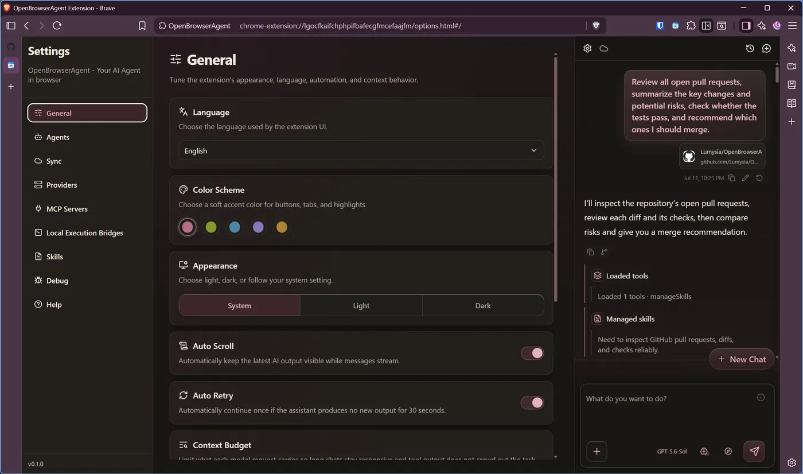
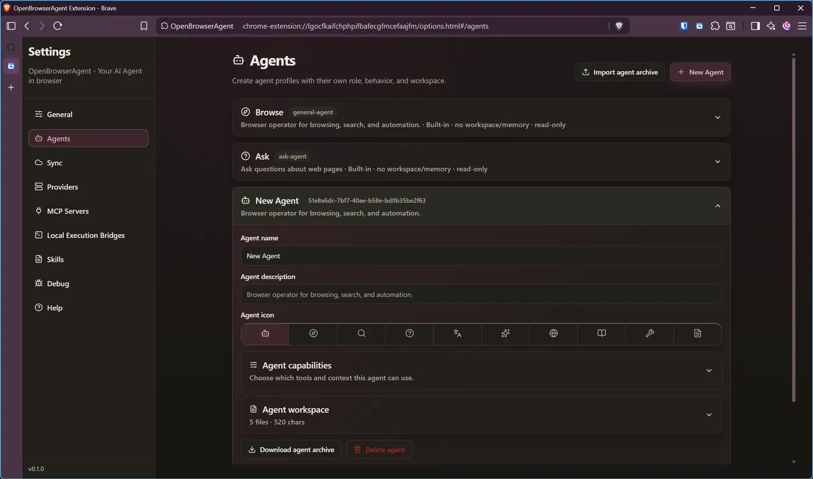
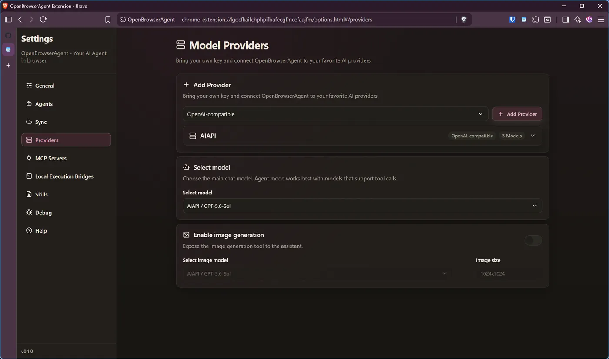
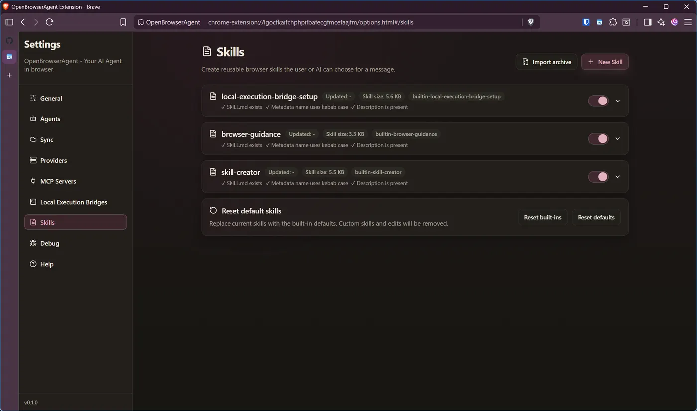
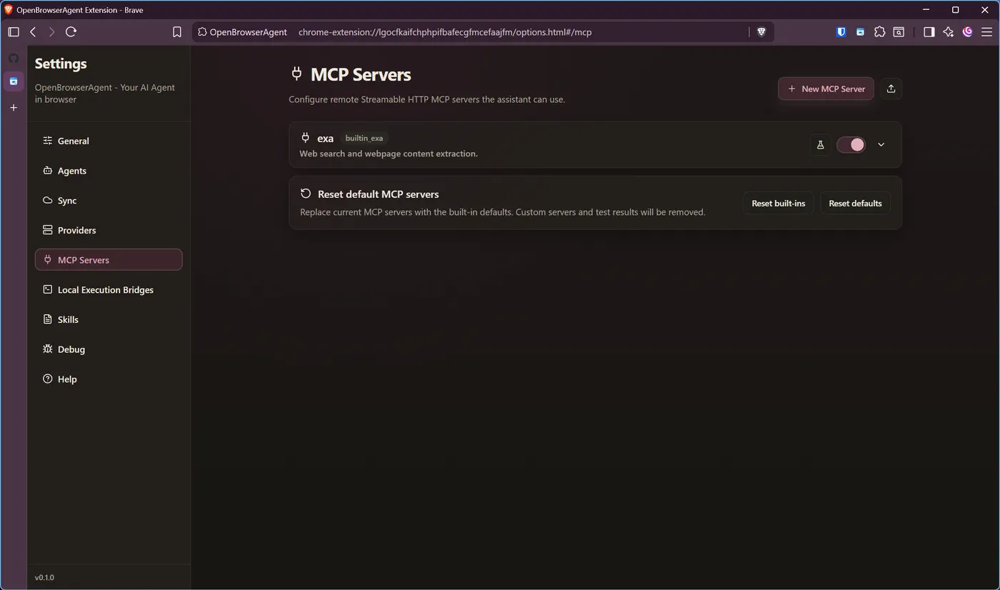
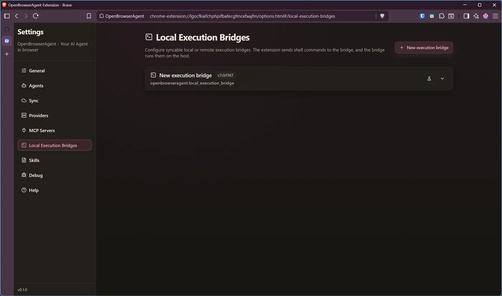
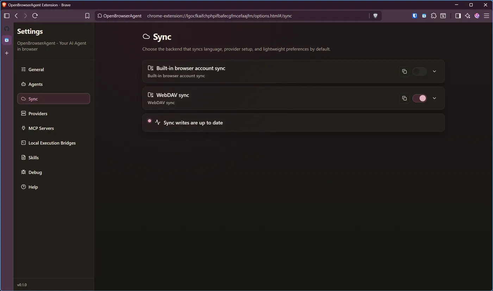

# OpenBrowserAgent

OpenBrowserAgent is an AI browser side panel for understanding pages, researching the web, and completing browser tasks with you in control.

It turns your browser into an AI working surface: bring page context into chat, switch between focused Q&A and action-oriented agent mode, connect your own models, and extend the assistant with reusable skills and remote MCP tools.

## Preview

<p align="center">
  <a href="https://github.com/user-attachments/assets/65d18645-f6d6-4ce2-952b-e225b9a923ba">
    
  </a>
  <br>
  <a href="https://github.com/user-attachments/assets/65d18645-f6d6-4ce2-952b-e225b9a923ba"><strong>Watch the demo</strong></a>
</p>

<table>
  <tr>
    <td width="33.33%"><strong>Custom agents</strong><br></td>
    <td width="33.33%"><strong>Model providers</strong><br></td>
    <td width="33.33%"><strong>Skills</strong><br></td>
  </tr>
  <tr>
    <td width="33.33%"><strong>MCP servers</strong><br></td>
    <td width="33.33%"><strong>Local execution bridges</strong><br></td>
    <td width="33.33%"><strong>Sync</strong><br></td>
  </tr>
</table>

## Why Use It

- **Work where the web already is.** Ask questions about the current page, compare tabs, summarize content, and keep sources close to the browser session.
- **Move from answers to action.** Agent mode can inspect pages, navigate tabs, click, type, search, download content, and use richer browser automation tools when needed.
- **Bring your own AI stack.** Configure model providers, API keys, base URLs, chat models, and image models without being locked into one backend.
- **Extend it with skills and MCP.** Save repeatable workflows as skills, import skill packages, and connect tested remote Streamable HTTP MCP servers for external tools like search and fetch.
- **Stay in control.** Tools are visible as they run, MCP servers must be tested before enabling, individual MCP tools can be toggled, and detailed tool JSON is available on demand.

## Highlights

- **Side panel chat** with streaming responses, queued messages, attachment-aware context, and polished tool activity cards.
- **Agent and Ask modes** for either browser automation or page-focused questions.
- **Tab and page context** including current tab metadata, page content, selected elements, and source-aware outputs.
- **Remote MCP tools** with a built-in web search preset, JSON import, connection testing, per-tool controls, and citation extraction from MCP results.
- **Reusable skills** with built-in browser guidance, skill import/export, editable skill files, and reset-to-default controls.
- **Source citations** that keep final answers tied to pages, files, skills, generated outputs, and MCP-provided web results.
- **Comprehensive settings** for providers, models, appearance, language, sync, agents, skills, MCP servers, and local execution bridges.
- **Theme-aware UI** with light/dark/system modes, accent colors, compact density, subtle motion, and localized interface text.

## Typical Workflows

- Research a topic from the side panel, fetch pages through an MCP search/fetch provider, and receive a cited summary.
- Ask questions about the active tab or attached pages without leaving the browser.
- Let the agent fill forms, click controls, organize tabs, or inspect page state while showing each tool step.
- Create a custom skill for a recurring workflow, then reuse it across chats.
- Configure multiple model providers and choose the best model for chat or image generation.

## Documentation

- [Product overview](docs/product-overview.md)
- [Installation and packaging](docs/installation-and-packaging.md)
- [Permissions and privacy](docs/permissions-and-privacy.md)

## Development

Use Node.js 22.19.0 or later in the 22.x line, or Node.js 24 or newer. Prefer a supported LTS release. WXT and its browser launcher are development dependencies installed by the commands below.

```bash
npm install
npm run dev
```

Browser-specific development targets are also available:

```bash
npm run dev:firefox
npm run dev:safari
```

## Build

```bash
npm run build
npm run build:firefox
npm run build:safari
```

Build outputs are written to `.output/chrome-mv3`, `.output/firefox-mv2`, and `.output/safari-mv2`.
